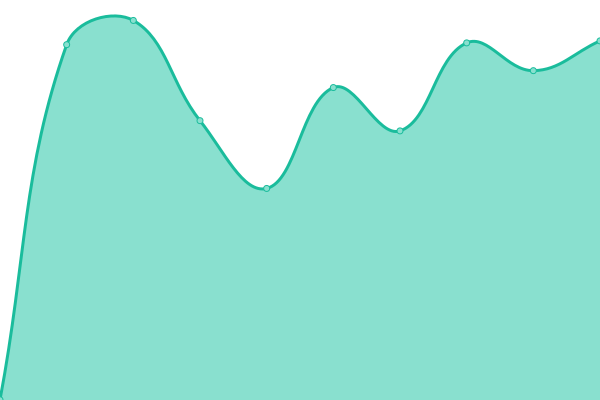

# [📈 Live Status](https://monitor.ylo.one): <!--live status--> **🟩 All systems operational**

This repository contains the open-source uptime monitor and status page for [injektorsolutions](https://monitor.ylo.one), powered by [Upptime](https://github.com/upptime/upptime).

With [Upptime](https://upptime.js.org), you can get your own unlimited and free uptime monitor and status page, powered entirely by a GitHub repository. We use [Issues](https://github.com/injektorsolutions/stats/issues) as incident reports, [Actions](https://github.com/injektorsolutions/stats/actions) as uptime monitors, and [Pages](https://monitor.ylo.one) for the status page.

<!--start: status pages-->
<!-- This summary is generated by Upptime (https://github.com/upptime/upptime) -->
<!-- Do not edit this manually, your changes will be overwritten -->
<!-- prettier-ignore -->
| URL | Status | History | Response Time | Uptime |
| --- | ------ | ------- | ------------- | ------ |
|  [Handinstrument.se](https://handinstrument.se/) | 🟩 Up | [handinstrument-se.yml](https://github.com/injektorsolutions/stats/commits/HEAD/history/handinstrument-se.yml) | 

 1241ms
     
 | 

<a href="https://stats.ylo.one/history/handinstrument-se">2.32%</a>
    

|  [IR-Termometer.se](https://ir-termometer.se/) | 🟩 Up | [ir-termometer-se.yml](https://github.com/injektorsolutions/stats/commits/HEAD/history/ir-termometer-se.yml) | 

 1673ms
     
 | 

<a href="https://stats.ylo.one/history/ir-termometer-se">100.00%</a>
    

|  [Egenkontroll.nu](https://egenkontroll.nu/) | 🟩 Up | [egenkontroll-nu.yml](https://github.com/injektorsolutions/stats/commits/HEAD/history/egenkontroll-nu.yml) | 

 1821ms
     
 | 

<a href="https://stats.ylo.one/history/egenkontroll-nu">90.00%</a>
    

|  [Refraktometer.se](https://refraktometer.se/) | 🟩 Up | [refraktometer-se.yml](https://github.com/injektorsolutions/stats/commits/HEAD/history/refraktometer-se.yml) | 

 1558ms
     
 | 

<a href="https://stats.ylo.one/history/refraktometer-se">98.08%</a>
    

|  [Mikroskop24.se](https://mikroskop24.se/) | 🟩 Up | [mikroskop24-se.yml](https://github.com/injektorsolutions/stats/commits/HEAD/history/mikroskop24-se.yml) | 

 1803ms
     
 | 

<a href="https://stats.ylo.one/history/mikroskop24-se">100.00%</a>
    

|  [Mikrometer.se](https://mikrometer.se/) | 🟩 Up | [mikrometer-se.yml](https://github.com/injektorsolutions/stats/commits/HEAD/history/mikrometer-se.yml) | 

 1445ms
     
 | 

<a href="https://stats.ylo.one/history/mikrometer-se">84.88%</a>
    

|  [Endoskop.se](https://endoskop.se/) | 🟩 Up | [endoskop-se.yml](https://github.com/injektorsolutions/stats/commits/HEAD/history/endoskop-se.yml) | 

 1635ms
     
 | 

<a href="https://stats.ylo.one/history/endoskop-se">0.00%</a>
    

|  [Handgerate.de](https://handgerate.de/) | 🟩 Up | [handgerate-de.yml](https://github.com/injektorsolutions/stats/commits/HEAD/history/handgerate-de.yml) | 

 1362ms
     
 | 

<a href="https://stats.ylo.one/history/handgerate-de">66.46%</a>
    

|  [Logger.nu](https://logger.nu/) | 🟩 Up | [logger-nu.yml](https://github.com/injektorsolutions/stats/commits/HEAD/history/logger-nu.yml) | 

 1634ms
     
 | 

<a href="https://stats.ylo.one/history/logger-nu">16.79%</a>
    

|  [Metrologi.se](https://metrologi.se/) | 🟩 Up | [metrologi-se.yml](https://github.com/injektorsolutions/stats/commits/HEAD/history/metrologi-se.yml) | 

 1236ms
     
 | 

<a href="https://stats.ylo.one/history/metrologi-se">81.28%</a>
    

|  [Optiska.se](https://optiska.se/) | 🟩 Up | [optiska-se.yml](https://github.com/injektorsolutions/stats/commits/HEAD/history/optiska-se.yml) | 

 1428ms
     
 | 

<a href="https://stats.ylo.one/history/optiska-se">28.61%</a>
    

|  [Refraktometer.nu](https://refraktometer.nu/) | 🟩 Up | [refraktometer-nu.yml](https://github.com/injektorsolutions/stats/commits/HEAD/history/refraktometer-nu.yml) | 

 1808ms
     
 | 

<a href="https://stats.ylo.one/history/refraktometer-nu">100.00%</a>
    

|  [Skjutmatt.se](https://skjutmatt.se/) | 🟩 Up | [skjutmatt-se.yml](https://github.com/injektorsolutions/stats/commits/HEAD/history/skjutmatt-se.yml) | 

 1612ms
     
 | 

<a href="https://stats.ylo.one/history/skjutmatt-se">98.00%</a>
    

|  [Termometer.dk](https://termometer.dk/) | 🟩 Up | [termometer-dk.yml](https://github.com/injektorsolutions/stats/commits/HEAD/history/termometer-dk.yml) | 

 1570ms
     
 | 

<a href="https://stats.ylo.one/history/termometer-dk">97.87%</a>
    

|  [Termometer.se](https://termometer.se/) | 🟩 Up | [termometer-se.yml](https://github.com/injektorsolutions/stats/commits/HEAD/history/termometer-se.yml) | 

 1942ms
     
 | 

<a href="https://stats.ylo.one/history/termometer-se">56.88%</a>
    

|  [Injektor.com](https://injektor.com/) | 🟩 Up | [injektor-com.yml](https://github.com/injektorsolutions/stats/commits/HEAD/history/injektor-com.yml) | 

 975ms
     
 | 

<a href="https://stats.ylo.one/history/injektor-com">100.00%</a>
    

|  [Mikrometer.dk](https://mikrometer.dk/) | 🟩 Up | [mikrometer-dk.yml](https://github.com/injektorsolutions/stats/commits/HEAD/history/mikrometer-dk.yml) | 

 1727ms
     
 | 

<a href="https://stats.ylo.one/history/mikrometer-dk">100.00%</a>
    

|  [Chat Server](https://chat.arbeteserver.com/) | 🟩 Up | [chat-server.yml](https://github.com/injektorsolutions/stats/commits/HEAD/history/chat-server.yml) | 

 474ms
     
 | 

<a href="https://stats.ylo.one/history/chat-server">100.00%</a>
    

|  [Fortnox Tools](https://ft.injektor.com/) | 🟩 Up | [fortnox-tools.yml](https://github.com/injektorsolutions/stats/commits/HEAD/history/fortnox-tools.yml) | 

 438ms
     
 | 

<a href="https://stats.ylo.one/history/fortnox-tools">100.00%</a>
    

|  [Suppliers (Price API)](https://node-injektor-suppliers.ylo.one/status) | 🟩 Up | [suppliers-price-api.yml](https://github.com/injektorsolutions/stats/commits/HEAD/history/suppliers-price-api.yml) | 

 521ms
     
 | 

<a href="https://stats.ylo.one/history/suppliers-price-api">100.00%</a>
    

|  [Static Files](https://files-static.ylo.one/niolo/database.png) | 🟩 Up | [static-files.yml](https://github.com/injektorsolutions/stats/commits/HEAD/history/static-files.yml) | 

 714ms
     
 | 

<a href="https://stats.ylo.one/history/static-files">0.00%</a>
    

<!--end: status pages-->

[**Visit our status website →**](https://monitor.ylo.one)

## 📄 License

- Powered by: [Upptime](https://github.com/upptime/upptime)
- Code: [MIT](./LICENSE) © [injektorsolutions](https://monitor.ylo.one)
- Data in the `./history` directory: [Open Database License](https://opendatacommons.org/licenses/odbl/1-0/)
